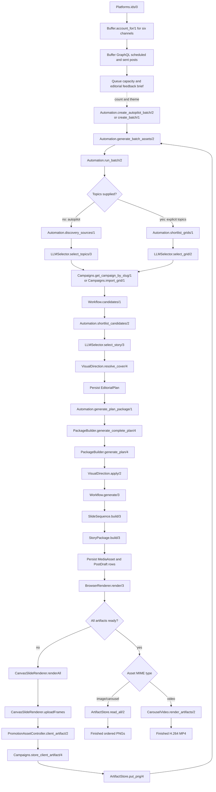

# Automatic Post Asset Generation

This guide covers the pipeline that turns RationalGrid source material into generated post drafts and finished media assets. Buffer scheduling, queue mutation, publishing calendars, and deletion of existing posts are out of scope; a small read-only Buffer feedback stage is included only to inform generation volume and themes.

Buffer can still provide a small, read-only feedback signal before asset generation. It determines how many packages are useful and which themes deserve consideration; it does not own asset composition or mutate a queue during this DAG.

## Optional stage 0: Buffer queue and performance feedback

The six supported destinations are returned by `GridMediaManager.Social.Platforms.ids/0`:

```text
x, linkedin, facebook, tiktok, instagram, youtube
```

For each platform, call `GridMediaManager.Social.Buffer.account_for/1` and fail the preflight visibly when credentials or a channel ID are missing. Text and video destinations can use different API keys and Buffer organizations, so group queries by account instead of assuming all six channels share one credential.

Call the implemented queue snapshot API, which fetches every currently `scheduled` post for the six channel IDs and follows cursor pagination until complete:

```elixir
platforms = GridMediaManager.Social.Platforms.ids()
{:ok, queue} = GridMediaManager.Social.Buffer.queue_snapshot(platforms)
```

The result is keyed by platform and includes `channel_id`, normalized `posts`, `scheduled_count`, and `vacancies`. It applies the project limit of ten queued posts per channel:

```text
vacancies[channel] = max(10 - scheduled_count[channel], 0)
```

For a package intended for all six destinations, the safe generation count is bounded by the smallest vacancy. For destination-specific generation, use the vacancy of only the channels served by that format. A full channel is not permission to delete, replace, or duplicate anything; it simply contributes zero available slots.

Fetch recent `sent` posts with `dueAt`, `text`, `channelId`, and `metrics` once for the same channels, normally over a 60–90 day window:

```elixir
until = DateTime.utc_now()
since = DateTime.add(until, -90 * 86_400, :second)

{:ok, performance} =
  GridMediaManager.Social.Buffer.performance_snapshot(platforms,
    since: since,
    until: until
  )
```

The function follows cursor pagination and rejects windows longer than Buffer's documented 365-day maximum. Buffer exposes normalized per-post metrics, but available metric names differ by network, so rank content within each channel rather than comparing raw impressions or reactions across platforms. Record sample sizes and avoid treating one unusually successful post as a durable trend.

Derive a compact read-only editorial brief:

```elixir
%{
  vacancies: %{platform => non_neg_integer},
  strong_themes: [%{theme: String.t(), platforms: [String.t()], evidence: map()}],
  saturated_themes: [String.t()],
  best_windows: %{platform => [%{weekday: String.t(), local_hour: 0..23}]},
  sample_sizes: %{platform => non_neg_integer}
}
```

Use `vacancies` to choose the requested batch count and use the strongest well-supported themes to construct the `theme` passed to `Automation.create_autopilot_batch/2`. Keep `best_windows` as scheduling metadata for a later publishing stage; it must not alter slides, rendering, or artifact identity. Preserve some exploration instead of generating only historically successful subjects.

Both snapshot functions are read-only and use the existing `Req` client. They require every requested platform to have credentials and a channel ID. Configure `organization_id` for a shared Buffer organization or `text_organization_id` and `video_organization_id` for separate accounts. If omitted, the client discovers the organization only when that authenticated account has exactly one; multiple organizations return an explicit ambiguity error.

Official references: [Buffer posts by channel](https://developers.buffer.com/examples/get-posts-for-channels.html), [posts with metrics](https://developers.buffer.com/examples/get-posts-with-metrics.html), and the [Buffer data model](https://developers.buffer.com/guides/data-model.html).

## Canonical entrypoints

Use `GridMediaManager.Automation` as the public orchestration boundary. Do not reproduce its planning logic in a LiveView, script, Mix task, or alternate media pipeline.

For automatic topic discovery:

```elixir
{:ok, batch} = GridMediaManager.Automation.create_autopilot_batch(count, theme)
{:ok, result} = GridMediaManager.Automation.generate_batch_assets(batch)
```

For caller-supplied topics, replace the first call with:

```elixir
{:ok, batch} = GridMediaManager.Automation.create_batch(topics)
```

`count` must be between 1 and 10. `GridMediaManager.RationalGrid.GridIndex` must already contain source summaries, and the OpenAI editorial selector must be configured for production use.

`result.status` is one of `:complete`, `:awaiting_artifacts`, `:partial`, or `:failed`. When it is `:awaiting_artifacts`, load each returned asset's `output.render_path` in a browser worker, wait for its canvas uploads, and call `generate_batch_assets/2` again. The second call resumes the existing batch and assets without repeating successful planning.

## Function DAG



The DAG shows conceptual ownership. Some internal calls are private and are reached through the public orchestration entrypoints rather than called directly.

## Stage contracts

### 1. Plan topics and sources

`Automation.run_batch/2` owns the entire grounded planning phase.

- Autopilot uses `Automation.discovery_sources/1` and `LLMSelector.select_topics/3` to choose distinct topics and source grids in one structured call.
- Explicit topics use `Automation.shortlist_grids/1` and `LLMSelector.select_grid/2` to choose a source.
- The selected grid is loaded with `Campaigns.get_campaign_by_slug/1` or imported with `Campaigns.import_grid/1`.
- Never allow the model to invent source slugs or candidate keys. The selector schemas constrain it to supplied values.

Output: one persisted `EditorialPlan` per topic, with a campaign, grounded selected keys, narrative order, format, visual style, cover direction, and confidence.

### 2. Select the story

For each chosen campaign, `Automation.run_batch/2` performs:

1. `Workflow.candidates/1` to discover questions, highlights, key nodes, and grid material.
2. `Automation.shortlist_candidates/2` to bound the material passed to the model.
3. `LLMSelector.select_story/3` to choose two to six candidate keys in narrative order.
4. `VisualDirection.resolve_cover/4` to choose a text cover or a selected Pexels image.

The plan's `selected_keys` order is significant and must survive every later stage.

### 3. Generate the complete package

Call only `Automation.generate_batch_assets(batch_or_id, opts)` for a complete run. It plans pending batches, processes plans with bounded concurrency, and internally delegates each planned item through `Automation.generate_plan_package/1`:

```text
PackageBuilder.generate_complete_plan/4
└── PackageBuilder.generate_plan/4
    ├── VisualDirection.style_for_plan/2
    ├── VisualDirection.cover_for_plan/3
    ├── VisualDirection.apply/2
    └── Workflow.generate/3
```

`generate_complete_plan/4` creates the plan's primary format and any missing companion format needed to cover both text and video destinations. Do not separately invoke format generators unless diagnosing a specific branch.

The orchestrator accepts a module implementing `GridMediaManager.Automation.Renderer` through its `:renderer` option. The default is `GridMediaManager.Automation.BrowserRenderer`. Tests and other execution environments can inject a renderer without changing planning or package generation.

`Workflow.generate/3` dispatches formats as follows:

| Format | Canonical generator |
| --- | --- |
| `portrait` | `Campaigns.generate_curated_carousel/3` |
| `story_video` | `Campaigns.generate_story_video/3` |
| `combined_carousel` | `Campaigns.generate_curated_carousel_bundle/3`, then `Campaigns.generate_curated_carousel_video/2` |
| `long_form` | `Campaigns.generate_long_form_post/3` |

These calls upsert `MediaAsset` rows and automatically create or refresh deterministic `PostDraft` rows through `Social.Templates`. At this point the post copy and media specification exist, but the PNG bytes do not.

### 4. Build one canonical slide sequence

Every carousel and video must have this shape:

```text
thumbnail-ready cover
→ one or more variable editorial text/quote/highlight cards
→ fixed CTA
```

`SlideSequence.build/3` owns content selection and normalisation. `StoryPackage.build/3` owns the outer cover/content/CTA invariant. Formats must consume this sequence rather than independently creating covers, text cards, or closing frames.

The CTA slide metadata identifies and orders the frame. Its visual source of truth is always:

```text
priv/static/images/rationalgrid-follow-up.png
```

The approved CTA is 1080 × 1350. Portrait output uses it edge-to-edge. A 1080 × 1920 video frame centers it without stretching on `#081323`. Never add another generated, server-rendered, or platform-specific CTA path.

### 5. Render and persist browser artifacts

`assets/js/canvas_slide_renderer.js` is the only visual compositor.

1. `CanvasSlideRenderer.renderAll()` renders every slide at 1080 × 1350 for image assets or 1080 × 1920 for video assets.
2. `CanvasSlideRenderer.uploadFrames()` posts each selected PNG to `POST /api/media-assets/:id/artifacts/:index` with the current `x-canvas-renderer-version` header.
3. `PromotionAssetController.client_artifact/2` validates the upload.
4. `Campaigns.store_client_artifact/4` persists artifact metadata on the asset.
5. `ArtifactStore.put_png/4` stores the finished bytes.

This is currently a required client-side stage. `BrowserRenderer.render/3` returns `{:pending, details}` with exact required indexes, missing indexes, and a Studio `render_path` until every frame exists. An unattended browser worker should load those paths; the caller then invokes `Automation.generate_batch_assets/2` again. Do not work around this boundary by adding an Elixir image renderer; that would recreate the duplicate pipeline that was intentionally removed.

### 6. Assemble final media

For image assets, the ordered PNGs in `ArtifactStore` are the finished output. Read them with `ArtifactStore.read_all/2` using `Campaigns.media_asset_slide_indexes/1`.

For video assets, call `CarouselVideo.render_artifacts/2` with those same selected indexes. ffmpeg only concatenates the finished PNG frames, applies their calculated durations, and emits H.264 MP4. It must never lay out text, regenerate slides, or replace missing frames.

`AssetRenderer.render_all/2` is the unified downstream read boundary when a caller needs finished media bodies regardless of type:

- Image/carousel: returns ordered PNG bodies.
- Video: runs ffmpeg assembly and returns one MP4 body.

## Idempotency and resume rules

- Batches and plans are persisted. Resume them instead of repeating LLM calls.
- Generated assets are upserted by campaign, kind, source type, source ID, and style.
- Every generated asset stores a render signature covering visual metadata, style, campaign cover state, and renderer version. Identical regeneration preserves completed artifacts; changed visual inputs invalidate them.
- Draft copy refreshes only while a draft remains editable; do not overwrite published state.
- Inspect `generate_batch_assets/2`'s uniform batch, plan, and asset statuses. Partial companion generation must not discard successful assets.
- Before rendering, calculate required indexes with `Campaigns.media_asset_slide_indexes/1`.
- Before ffmpeg or downstream delivery, require `ArtifactStore.ready?/2` for every required index.
- Never substitute a raw Pexels image when a composed artifact is missing.

## Renderer invalidation

`ArtifactStore.renderer_version/0` is currently version 9. Bump it whenever canvas composition or a fixed visual asset changes. Stale artifacts are deliberately ignored. The renderer version and CTA source path are included in the browser fingerprint so changed media is saved again.

## Verification checklist

For each planned topic, verify:

- `EditorialPlan.status == "planned"` and selected keys are grounded in `Workflow.candidates/1`.
- `Automation.generate_batch_assets/2` returns a uniform status for the batch, every plan, and every asset.
- Both text and video destination coverage exists when a complete package is requested.
- Every asset has a cover, at least one content frame, and the CTA last.
- Every required artifact index is current and present.
- Every portrait CTA uses `rationalgrid-follow-up.png` exactly.
- Every video is assembled only after all required PNGs exist.
- Corresponding `PostDraft` rows contain platform-appropriate deterministic copy.

After code changes, run focused tests, `mix assets.build`, and `mix precommit`. For Studio behaviour, inspect source first and verify with Tidewave `browser_eval`. Do not restart Phoenix for ordinary code changes.
